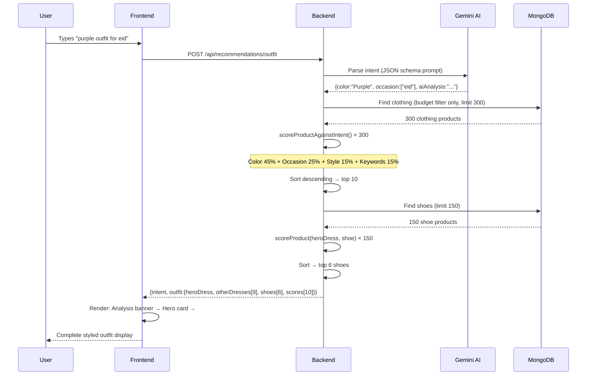
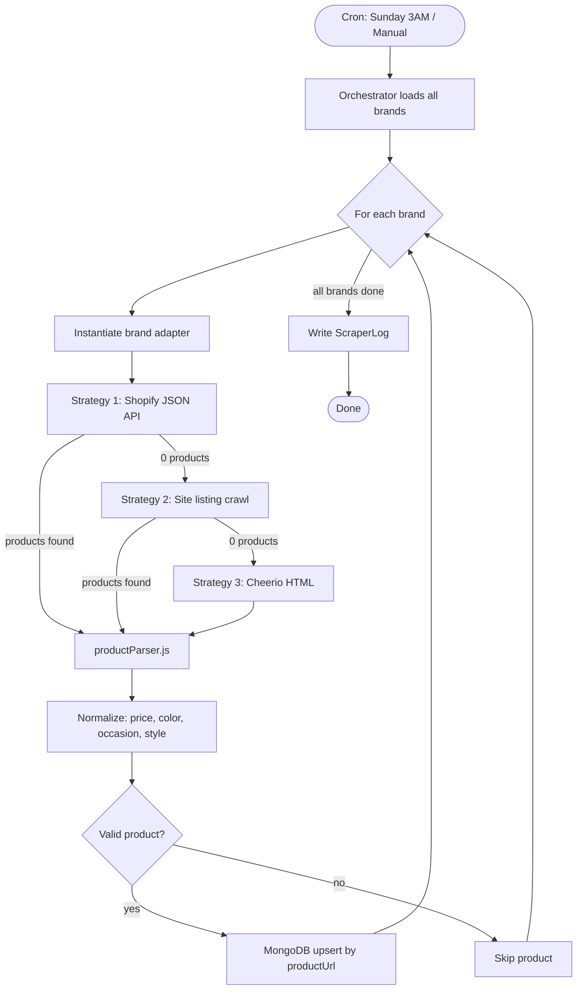

# AuraFit — Complete Technical Documentation

> AI-powered Pakistani fashion discovery platform. Real products. Real brands. Intelligent curation.

---

## Table of Contents

1. [System Architecture Overview](#1-system-architecture-overview)
2. [Technology Stack](#2-technology-stack)
3. [Project Structure](#3-project-structure)
4. [Scraper System](#4-scraper-system)
5. [AI Recommendation Engine](#5-ai-recommendation-engine)
6. [API Reference](#6-api-reference)
7. [Frontend Architecture](#7-frontend-architecture)
8. [Data Model](#8-data-model)
9. [Color Theory Engine](#9-color-theory-engine)
10. [Authentication & Security](#10-authentication--security)
11. [Feature Flow Diagrams](#11-feature-flow-diagrams)
12. [Deployment & Environment](#12-deployment--environment)

---

## 1. System Architecture Overview

```
┌─────────────────────────────────────────────────────────────────────┐
│                         USER BROWSER                                │
│              Next.js 16 App (React 19 + TypeScript)                 │
└────────────────────────────────┬────────────────────────────────────┘
                                 │ HTTPS / Axios
                                 ▼
┌─────────────────────────────────────────────────────────────────────┐
│                      EXPRESS BACKEND (Node.js)                       │
│   /api/products  /api/recommendations  /api/search  /api/auth       │
└──────────┬──────────────────────────────────────┬───────────────────┘
           │ Mongoose ODM                          │ @google/generative-ai
           ▼                                       ▼
┌──────────────────────┐               ┌──────────────────────────────┐
│   MongoDB Atlas       │               │      Google Gemini 2.5 Flash  │
│  (Product, User,      │               │  Intent Parsing + AI Analysis │
│   Favorite, Log)      │               └──────────────────────────────┘
└──────────────────────┘

Separate async process:
┌───────────────────────────────────────────────────────────────────┐
│                     SCRAPER SYSTEM (node-cron)                     │
│  Orchestrator → Brand Adapters → Extractors → Parser → MongoDB    │
│                                                                    │
│  Brands: Khaadi, Beechtree, Limelight, Alkaram, Gul Ahmed (5 clothing)│
│          Stylo, ECS, Borjan, Hush Puppies, Ndure (5 shoes)        │
└───────────────────────────────────────────────────────────────────┘
```

---

## 2. Technology Stack

| Layer | Technology | Purpose |
|-------|-----------|---------|
| Frontend | Next.js 16, React 19, TypeScript | App Router SSR/CSR hybrid |
| Styling | Tailwind CSS 4 + custom CSS design system | Warm gold glassmorphism theme |
| HTTP Client | Axios | Typed API calls with JWT interceptor |
| Backend | Node.js 20 + Express 4 | REST API server |
| Database | MongoDB Atlas + Mongoose 8 | Product/User storage |
| AI | Google Gemini 2.5 Flash | Intent parsing + AI analysis |
| Embeddings | Gemini text-embedding | Semantic similarity vectors |
| Scraping | Axios + Cheerio | Multi-strategy HTML/JSON extraction |
| Scheduling | node-cron | Weekly auto-scrape |
| Auth | JWT (jsonwebtoken) + bcryptjs | Stateless auth |
| Security | Helmet, CORS, express-rate-limit | API hardening |

---

## 3. Project Structure

```
AuraFit/
├── backend/
│   ├── config/
│   │   └── db.js                    # MongoDB Atlas connection
│   ├── middleware/
│   │   └── auth.js                  # JWT verification + role guard
│   ├── models/
│   │   ├── Product.js               # Core product schema
│   │   ├── User.js                  # User accounts
│   │   ├── Favorite.js              # User saved items
│   │   └── ScraperLog.js            # Scrape run audit logs
│   ├── routes/
│   │   ├── auth.js                  # Login / Register / Me
│   │   ├── products.js              # Product CRUD + featured
│   │   ├── recommendations.js       # AI outfit generation
│   │   ├── search.js                # Full-text + fallback search
│   │   ├── favorites.js             # Toggle / list favorites
│   │   └── admin.js                 # Admin dashboard APIs
│   ├── services/
│   │   ├── recommendationEngine.js  # Scoring algorithms
│   │   └── colorTheory.js           # Fashion color compatibility matrix
│   ├── scripts/scrapers/
│   │   ├── index.js                 # Scrape orchestrator
│   │   ├── scraper.js               # Core strategy runner
│   │   ├── adapters/                # Per-brand adapter classes
│   │   │   ├── BaseAdapter.js
│   │   │   ├── KhaadiAdapter.js
│   │   │   ├── BeechtreeAdapter.js
│   │   │   └── ...
│   │   ├── extractors/
│   │   │   ├── ShopifyExtractor.js  # Shopify JSON API extraction
│   │   │   └── HtmlExtractor.js     # Cheerio HTML extraction
│   │   ├── parsers/
│   │   │   └── productParser.js     # Data normalization & inference
│   │   ├── utils/
│   │   │   ├── colorInference.js    # Infer color from product title
│   │   │   ├── requestRetry.js      # Axios with exponential backoff
│   │   │   └── logger.js            # Structured scrape logging
│   │   └── config/
│   │       ├── clothingBrands.js    # 5 clothing brand configs
│   │       └── shoeBrands.js        # 5 shoe brand configs
│   ├── jobs/
│   │   └── scraperJob.js            # node-cron weekly scheduler
│   └── server.js                    # Express app bootstrap
│
├── frontend/src/
│   ├── app/
│   │   ├── page.tsx                 # Home: hero + AI chat + featured
│   │   ├── discover/page.tsx        # Product browser with filters
│   │   ├── search/page.tsx          # Semantic search page
│   │   ├── product/[id]/page.tsx    # Product detail + recommendations
│   │   ├── favorites/page.tsx       # Saved items
│   │   ├── admin/page.tsx           # Admin dashboard
│   │   ├── login/page.tsx
│   │   ├── register/page.tsx
│   │   ├── layout.tsx               # Root layout + Navbar
│   │   └── globals.css              # Design system tokens + utilities
│   ├── components/
│   │   ├── Navbar.tsx               # Sticky nav with scroll behavior
│   │   ├── ProductCard.tsx          # Reusable card with favorite toggle
│   │   ├── ChatBox.tsx              # AI style input
│   │   └── RecommendationResult.tsx # Outfit display component
│   ├── context/
│   │   └── AuthContext.tsx          # Global JWT auth state
│   └── lib/
│       └── api.ts                   # Axios instance + typed API helpers
│
└── AURAFIT_DOCUMENTATION.md         # This file
```

---

## 4. Scraper System

### 4.1 Architecture — 3-Strategy Waterfall

Every brand adapter tries three extraction strategies in sequence, falling back to the next if the previous returns zero products:

```
Brand Config (URL + collections + metadata)
        │
        ▼
┌─────────────────────────────────────┐
│       Strategy 1: Shopify JSON API  │  ← Fastest, most structured
│  GET /products.json?limit=250&page=N│
│  JSON → productParser.js            │
└────────────────┬────────────────────┘
                 │ 0 results?
                 ▼
┌─────────────────────────────────────┐
│     Strategy 2: Site Listing Crawl  │  ← Fallback for irregular Shopify
│  Paginated /products.json crawl     │
│  with custom pagination logic       │
└────────────────┬────────────────────┘
                 │ 0 results?
                 ▼
┌─────────────────────────────────────┐
│     Strategy 3: Cheerio HTML Parse  │  ← Deepest fallback (any site)
│  Brand-specific CSS selectors       │
│  Finds product listings in HTML DOM │
└────────────────┬────────────────────┘
                 │
                 ▼
        productParser.js
        (normalize + infer)
                 │
                 ▼
        MongoDB upsert
     (productUrl = unique key)
```

### 4.2 Covered Brands

**Clothing (5 brands):**
| Brand | Domain | Strategy | Notes |
|-------|--------|----------|-------|
| Khaadi | pk.khaadi.com | HTML (S3) | JS-rendered; HTML extraction required |
| Beechtree | beechtree.pk | Shopify JSON (S1) | Native Shopify |
| Limelight | limelight.pk | Shopify JSON (S1) | Native Shopify |
| Alkaram Studio | alkaramstudio.com | Shopify JSON (S1) | Native Shopify |
| Gul Ahmed | gulahmedshop.com | Shopify JSON (S1) | Native Shopify |

**Shoes (5 brands):**
| Brand | Domain | Strategy | Notes |
|-------|--------|----------|-------|
| Stylo | stylo.pk | Shopify JSON (S1) | Native Shopify |
| ECS | shopecs.com | Shopify JSON (S1) | Native Shopify |
| Borjan | borjan.com.pk | Shopify JSON (S1) | Native Shopify |
| Hush Puppies | hushpuppies.com.pk | HTML (S3) | Custom HTML selectors |
| Ndure | ndure.com | Shopify JSON (S1) | Native Shopify |

### 4.3 Product Parser — Inference Pipeline

When a product is scraped, `productParser.js` enriches the raw data:

```
Raw product data (from extractor)
        │
        ├─ normalize brand name
        ├─ normalize category
        ├─ parse price string → number (PKR)
        │
        ├─ COLOR INFERENCE ──────────────────────────────────┐
        │   1. Scan product title for color keywords         │
        │   2. Scan description for color keywords           │
        │   3. Scan variant names (e.g., "Size: M / Purple") │
        │   → Sets primaryColor + colors[]                   │
        │                                                     │
        ├─ OCCASION INFERENCE ──────────────────────────────┐│
        │   Keywords: "eid" → eid, "formal" → formal,       ││
        │   "wedding" → wedding, "casual" → casual, etc.    ││
        │   → Sets occasion[]                                ││
        │                                                     ││
        ├─ STYLE INFERENCE ──────────────────────────────────┘│
        │   Keywords: "embroidered" → embroidered,            │
        │   "printed" → trendy, "plain" → minimal, etc.      │
        │   → Sets style[]                                    │
        │                                                     │
        ├─ METADATA SCORE (0-1 completeness rating)          │
        │   Checks: name, price, image, url, color, occasion │
        │                                                     │
        └─ Validate required fields → return or skip         │
```

### 4.4 Scraper Config — Collection Metadata

Each brand config defines which collections to scrape and pre-assigns metadata:

```javascript
// Example from clothingBrands.js
{
  name: 'Beechtree',
  baseUrl: 'https://beechtree.pk',
  adapter: 'BeechtreeAdapter',
  category: 'clothing',
  collections: [
    {
      path: '/collections/eid-collection',
      subCategory: '3-piece',
      occasion: ['eid', 'party'],
      style: ['elegant', 'embroidered', 'traditional']
    },
    {
      path: '/collections/casual-wear',
      subCategory: 'kurta',
      occasion: ['casual'],
      style: ['minimal', 'trendy']
    }
  ]
}
```

This means the **occasion** and **style** arrays are partially pre-assigned from collection metadata, then augmented by keyword inference from the product text.

### 4.5 Scheduled Scraping

```
node-cron: "0 3 * * 0"  (Every Sunday at 3:00 AM PKT)
         │
         ├─ Loads all brand adapters
         ├─ Runs each brand sequentially (to avoid IP bans)
         ├─ Upserts products (productUrl = unique key, idempotent)
         ├─ Logs results to ScraperLog collection
         └─ Sends summary to console
```

CLI usage:
```bash
npm run scrape           # Full production run
npm run scrape:dry       # Parse only, no DB writes (SCRAPER_DRY_RUN=true)
```

---

## 5. AI Recommendation Engine

### 5.1 Two Distinct Scoring Systems

AuraFit uses **two different scoring functions** depending on the context:

#### System A — Product-to-Product (Product Detail Page)
Used when a user views a product and wants to see matching shoes or complementary clothing.

```
finalScore = embeddingSimilarity × 0.50
           + colorCompatibility  × 0.20
           + occasionMatch       × 0.20
           + styleMatch          × 0.10
```

| Component | Weight | Method |
|-----------|--------|--------|
| Embedding similarity | 50% | Cosine similarity between Gemini embedding vectors. Falls back to keyword Jaccard if embeddings missing. |
| Color compatibility | 20% | Fashion color theory matrix (14×14 lookup) |
| Occasion overlap | 20% | Jaccard index between occasion arrays |
| Style overlap | 10% | Jaccard index between style arrays |

#### System B — Intent-to-Product (Chat "Style Me" Feature)
Used when a user submits a natural language query. This is the **dynamic** system that replaced the previous rule-based approach.

```
finalScore = colorMatch    × 0.45
           + occasionMatch × 0.25
           + styleMatch    × 0.15
           + keywordMatch  × 0.15
```

**Why different weights?** When a user explicitly says "purple dress", color correctness matters most. The 45% color weight ensures purple items rank far above white/black items even if the DB-level color storage format varies.

### 5.2 Color Match Algorithm (Intent System)

This is the fix for the "purple shows white" bug. The algorithm works in three tiers:

```
User asks: "purple dress for eid"
Gemini parses: color = "Purple"

For each product in pool (300 items):

  Tier 1 — Canonical alias match
    normalizeColor("Lavender") → "Purple"
    normalizeColor("Lilac")    → "Purple"
    normalizeColor("Violet")   → "Purple"
    If product's normalized color == target normalized color → score = 1.0

  Tier 2 — Substring match
    product.primaryColor = "Light Purple"
    "light purple".includes("purple") → true → score = 0.82

  Tier 3 — No match
    product.primaryColor = "White" → score = 0.08 (hard penalty)

Color alias map covers 40+ common variations:
  lavender/lilac/mauve/plum/violet/grape → Purple
  navy/cobalt/sky blue/royal blue        → Blue
  maroon/crimson/burgundy/wine/rust      → Red
  ivory/cream/off-white/snow             → White
  blush/peach/rose/fuchsia               → Pink
  ...
```

This replaces the old approach of `$regex` filtering on MongoDB (which failed when colors were stored as aliases).

### 5.3 Intent Parsing with Gemini

```
User Input: "I need a pastel purple outfit for my sister's wedding under 15000"
                │
                ▼
        Gemini 2.5 Flash
        (responseMimeType: 'application/json')
                │
                ▼
{
  "color": "Purple",
  "occasion": ["wedding"],
  "style": ["elegant", "traditional"],
  "maxBudget": 15000,
  "intentSummary": "An elegant purple outfit for a wedding under PKR 15,000.",
  "aiAnalysis": "Purple is a royal and celebratory color ideal for weddings.
                 A 3-piece chiffon suit with embroidered detailing would be
                 perfect. Pair with silver heels and antique jewelry for a
                 complete bridal guest look."
}
                │
                ▼
        getOutfitForQuery(parsedIntent)
                │
                ├─ Fetch 300 clothing products (budget filter only)
                ├─ Score each with scoreProductAgainstIntent()
                ├─ Sort descending by score
                ├─ Take top 10 clothing → heroDress + 9 others
                ├─ Fetch 150 shoes
                ├─ Score shoes against heroDress (System A)
                └─ Return top 6 shoes
```

### 5.4 Keyword Similarity Fallback

When Gemini embeddings are not available (products not yet embedded), the engine falls back to a keyword-based Jaccard-like similarity:

```javascript
// Extracts meaningful words from product fields
extractKeywords(product) → Set<string>

// Scores overlap between two keyword sets
overlap / sqrt(size1 * size2) + 0.2
// Capped at 0.9 to leave headroom for color/occasion
```

Stop words filtered: `with, that, this, from, your, have, will, been, more, than, they, their, what, when, where, which`

---

## 6. API Reference

### Products
```
GET  /api/products                    # List with filters
GET  /api/products/featured           # 6 clothing + 4 shoes (random)
GET  /api/products/stats              # Counts, price range
GET  /api/products/:id                # Single product

Query params for list:
  category, brand, occasion, style, color
  minPrice, maxPrice, sort, order
  page (default 1), limit (max 48, default 24)
```

### Recommendations
```
GET  /api/recommendations/:productId  # Product-to-product recs
POST /api/recommendations/outfit      # Chat-based outfit
  Body: { "message": "purple dress for eid" }
  Response: {
    intent: { color, occasion, style, maxBudget, intentSummary, aiAnalysis },
    outfit: { heroDress, otherDresses[9], shoes[6], scores[10] }
  }
```

### Search
```
GET  /api/search?q=&category=&color=&page=
  Strategy 1: MongoDB full-text index ($text)
  Strategy 2: Regex fallback on name/brand/tags/description

GET  /api/search/suggestions?q=      # Top 8 autocomplete
```

### Auth
```
POST /api/auth/register  { name, email, password }
POST /api/auth/login     { email, password }
GET  /api/auth/me        (JWT required)
```

### Favorites
```
GET    /api/favorites              (JWT required)
POST   /api/favorites/:productId   Toggle add/remove
GET    /api/favorites/check/:id    { isFavorited: bool }
DELETE /api/favorites/:productId
```

### Admin
```
GET  /api/admin/stats              # Product counts, 7-day growth
GET  /api/admin/scraper/logs       # Last 20 scrape runs
GET  /api/admin/scraper/status     # Is scraper running?
POST /api/admin/scraper/run        # Trigger async scrape
DELETE /api/admin/products/brand/:brand  # Remove brand data
All require: Authorization: Bearer <admin-jwt>
```

---

## 7. Frontend Architecture

### 7.1 Pages

| Route | Component | Description |
|-------|-----------|-------------|
| `/` | `page.tsx` | Hero + AI chat + featured grid |
| `/discover` | `discover/page.tsx` | URL-driven filters + pagination |
| `/search` | `search/page.tsx` | Debounced semantic search |
| `/product/[id]` | `product/[id]/page.tsx` | Detail + product-to-product recs |
| `/favorites` | `favorites/page.tsx` | Auth-protected saved items |
| `/admin` | `admin/page.tsx` | Stats, scraper control, logs |
| `/login` | `login/page.tsx` | Email/password login |
| `/register` | `register/page.tsx` | Account creation |

### 7.2 AI Chat Result Display Flow

```
User types query + presses Enter / "Style Me"
                │
                ▼
  recommendationsApi.outfit(message)
  POST /api/recommendations/outfit
                │
                ▼
  setChatResult(res.data)
  Smooth scroll to #ai-result
                │
                ▼
  ┌─────────────────────────────────────┐
  │  Gemini AI Analysis Card            │
  │  - AI icon                          │
  │  - intentSummary (italic quote)     │
  │  - aiAnalysis (2-3 sentence detail) │
  │  - Color / Occasion / Style tags    │
  └─────────────────────────────────────┘
                │
                ▼
  ┌─────────────────────────────────────┐
  │  #1 Best Match Card (Hero)          │
  │  - Large product image (left)       │
  │  - Brand + Name (right)             │
  │  - Metadata tags (color, occasion)  │
  │  - Score breakdown bars:            │
  │    Color Match      ████████ 82%    │
  │    Occasion Fit     ██████   65%    │
  │    Style Alignment  █████    55%    │
  │    Keyword Relevance████     45%    │
  │  - PKR price (large)                │
  │  - "Shop This Look →" CTA          │
  └─────────────────────────────────────┘
                │
                ▼
  ┌─────────────────────────────────────┐
  │  Top N Results (numbered #2–#10)    │
  │  ┌──┐ ┌──┐ ┌──┐ ┌──┐              │
  │  │#2│ │#3│ │#4│ │#5│  ...          │
  │  └──┘ └──┘ └──┘ └──┘              │
  │  ProductCard grid with rank badge   │
  └─────────────────────────────────────┘
                │
                ▼
  ┌─────────────────────────────────────┐
  │  Matching Shoes                     │
  │  ┌──┐ ┌──┐ ┌──┐ ┌──┐ ┌──┐ ┌──┐   │
  │  Best pair shoes from shoe pool     │
  │  (scored against heroDress)         │
  └─────────────────────────────────────┘
```

### 7.3 Design System

The UI uses a **warm champagne gold glassmorphism** aesthetic:

```css
--bg-primary:   #0c0b0a   /* Near-black warm */
--bg-card:      #181614   /* Card surfaces */
--accent:       #c9a96e   /* Champagne gold */
--accent-light: #e2c898   /* Lighter gold */
--accent-warm:  #d4956a   /* Warm orange-gold */
--text-primary: #f0ece6   /* Warm white */
--font-display: Cormorant Garamond (serif, elegant)
--font-body:    Inter (sans-serif, readable)
```

Key utility classes: `.product-card`, `.product-grid`, `.chip`, `.score-bar`, `.tag`, `.btn-primary`, `.glass-card`, `.title-gradient`

---

## 8. Data Model

### Product Schema (key fields)

```javascript
{
  name:         String (required, max 200)
  brand:        String (required)
  category:     'clothing' | 'shoes' | 'accessories'
  subCategory:  '2-piece' | '3-piece' | 'kurta' | 'heels' | 'sandals' | ...
  
  style:        String[]    // ['elegant', 'embroidered', 'minimal', ...]
  occasion:     String[]    // ['eid', 'wedding', 'casual', 'formal', ...]
  season:       String[]    // ['summer', 'winter', 'all-season']
  
  colors:       String[]    // ['Purple', 'Gold']
  primaryColor: String      // dominant color (colors[0])
  
  price:        Number (PKR, required)
  compareAtPrice: Number    // original price if on sale
  
  imageUrl:     String      // primary image
  images:       String[]    // all product images
  productUrl:   String (unique) // source URL — dedup key
  
  embedding:    Number[]    // Gemini semantic vector
  metadataScore: Number     // completeness 0-1
  
  scrapedAt:    Date
  updatedAt:    Date
}

Indexes:
  { brand, category }
  { category, subCategory }
  { primaryColor, category }
  { occasion }
  { price }
  { name, description, tags, brand }  ← Full-text index
```

---

## 9. Color Theory Engine

### 9.1 Compatibility Matrix

`colorTheory.js` implements a 14×14 fashion compatibility matrix scoring how well two colors pair together (0 = clash, 1 = perfect):

```
            Black  White  Red   Gold  Pink  Blue  Green  Grey  Purple  Teal  Brown  Orange  Yellow  Multi
Black         0.8   1.0   0.9   1.0  0.85  0.75   0.70  0.80    0.80  0.75   0.70    0.60    0.60   0.70
White         1.0   0.7    —    0.85  0.90  0.95   0.85  0.85    0.80  0.85   0.80    0.75    0.75   0.80
Red           0.9   0.85   —    0.85  0.30  0.60   0.50  0.70    0.55  0.60   0.65    0.20    0.50   0.70
Gold          1.0   0.85  0.85   —    0.70  0.80   0.90  0.70    0.75  0.70   0.75    0.50     —     0.75
Pink          0.85  0.90   —    0.70   —    0.70   0.65  0.80    0.60  0.65   0.70    0.30    0.50   0.70
Purple        0.80  0.80   —    0.75  0.60  0.60   0.55  0.70     —    0.65    —      0.30    0.40   0.70
...
```

Notable fashion rules encoded:
- **Black + Gold = 1.0** (classic elegance)
- **White + Blue = 0.95** (fresh, clean)
- **Red + Orange = 0.20** (strong clash)
- **Pink + Red = 0.30** (similar warm tones clash)
- **Purple + Orange = 0.30** (complementary but clash in traditional fashion)

### 9.2 Color Normalization & Aliases

40+ color aliases are resolved to canonical names before matrix lookup:

```
lavender, lilac, mauve, plum, violet, grape → Purple
navy, navy blue, cobalt, sky blue, royal blue → Blue
maroon, crimson, burgundy, wine, rust → Red
ivory, cream, off-white, snow → White
blush, peach, rose, fuchsia, hot pink → Pink
emerald, olive, mint, sage, forest green → Green
beige, nude, camel, fawn, khaki, sand → Beige
chocolate, mocha, coffee, caramel, tan → Brown
turquoise, aqua, cyan, seafoam → Teal
mustard, lemon, saffron → Yellow
coral, terracotta, amber → Orange
```

---

## 10. Authentication & Security

### 10.1 JWT Flow

```
Register/Login → bcrypt verify → JWT signed (7d expiry) → stored in localStorage
                                          │
                                          ▼
Every API request → Authorization: Bearer <token>
                          │
                          ▼
                 auth.js middleware
                 jwt.verify(token, JWT_SECRET)
                 req.user = { userId, email, role }
```

### 10.2 Security Layers

| Layer | Implementation |
|-------|---------------|
| Password hashing | bcryptjs, 12 rounds |
| Token signing | RS256 with 7-day expiry |
| API hardening | Helmet (15 security headers) |
| CORS | Configurable origin whitelist |
| Rate limiting | express-rate-limit (100 req/15min) |
| Input validation | Express-validator on auth routes |
| Query injection | Mongoose parameterized queries |
| Admin guard | `requireAdmin` middleware checks `role: 'admin'` |

---

## 11. Feature Flow Diagrams

### 11.1 Full "Style Me" Request Flow



### 11.2 Scraper Execution Flow



### 11.3 Color Scoring in Recommendation Engine

```
User Query: "purple"
                │
                ▼
    normalizeColor("purple") → "Purple"
                │
    For each product:
    ┌─────────────────────────────────────┐
    │ Product.primaryColor = "Lavender"   │
    │ normalizeColor("Lavender") = "Purple"│
    │ Match! colorScore = 1.0             │
    └─────────────────────────────────────┘
    ┌─────────────────────────────────────┐
    │ Product.primaryColor = "Light Purple"│
    │ "light purple".includes("purple") ✓ │
    │ Substring match: colorScore = 0.82  │
    └─────────────────────────────────────┘
    ┌─────────────────────────────────────┐
    │ Product.primaryColor = "White"      │
    │ No match, no alias overlap          │
    │ Hard penalty: colorScore = 0.08     │
    └─────────────────────────────────────┘
                │
    Sort by finalScore desc
    → Purple items always rank above White items
```

---

## 12. Deployment & Environment

### 12.1 Required Environment Variables

**Backend (`backend/.env`):**
```env
MONGO_URI=mongodb+srv://...
JWT_SECRET=<long-random-string>
GEMINI_API_KEY=<your-gemini-api-key>
PORT=5000
NODE_ENV=production
SCRAPER_CRON_SCHEDULE=0 3 * * 0
SCRAPER_DRY_RUN=false
```

**Frontend (`frontend/.env.local`):**
```env
NEXT_PUBLIC_API_URL=http://localhost:5000/api
```

### 12.2 Local Development

```bash
# Backend
cd backend
npm install
npm run dev          # nodemon with ESM

# Frontend
cd frontend
npm install
npm run dev          # Next.js dev server (port 3000)

# Run scraper manually
cd backend
npm run scrape       # Full run
npm run scrape:dry   # Dry run (no DB writes)
```

### 12.3 Scraper Recommendations

**For best results:**
1. Run the scraper first to populate the database
2. Recommended: 500+ products from at least 3-4 brands
3. Ensure both clothing AND shoes are scraped (needed for complete outfit generation)
4. Products without `primaryColor` or `occasion` fields will score lower in recommendations

**Improving recommendation quality:**
- Run scraper weekly (or configure `SCRAPER_CRON_SCHEDULE`)
- Products with embeddings (Gemini vectors) get better semantic matching
- Color inference from product titles is automatic but works best with descriptive product names

---

*AuraFit Technical Documentation — Generated 2026-05-10*
